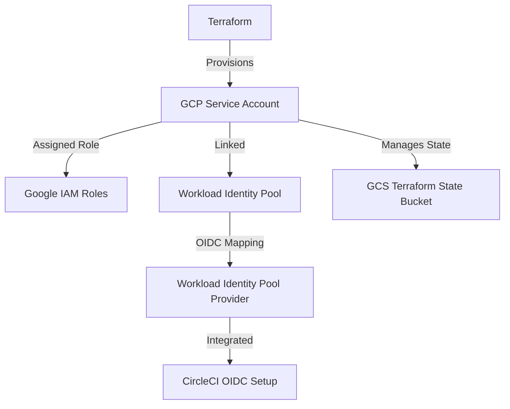

# Terraform GCP Service Account Setup

## Overview
This Terraform script provisions a Google Cloud Platform (GCP) service account, configures IAM roles, and sets up Workload Identity Pool for CircleCI integration. The infrastructure state is managed in a Google Cloud Storage (GCS) bucket.

## Resources Created using this config

- **Service Account:** A new GCP service account for Terraform usage. 
- **IAM Role Assignment:** Roles required to perform GCP functions via CircleCI are assigned to the service account.
- **Workload Identity Pool & Provider:** Configures workload identity for secure authentication with CircleCI. This template can be leveraged to allow more fine-grained permissions to users running CircleCI pipelines (At this time, the ability to restrict access based on an `organization-id`/`project-id`/`vcs-branch`/`context`/`user-id` is possible. 
- **GCS Backend:** For storing the Terraform state in a GCS bucket.

## Prerequisites

Before running the Terraform script, ensure the following are set up:

- [`gCloud CLI`](https://cloud.google.com/sdk/docs/install) is installed and configured.
- Access to a GCP project is available.
- Terraform (>=1.8.0) is installed.

Additionally, you can fork, modify, and reuse the provided [config.yml](https://github.com/AwesomeCICD/circleci-oidc-gcp-terraform/blob/main/.circleci/config.yml) file to apply the Terraform configuration via CircleCI.

## Variables
The Terraform script uses several variables. Below are the key ones:

| Variable Name | Type | Default | Description |
|--------------|------|---------|-------------|
| `gcp_project_id` | string | `dev-vijay-pandian` | The GCP project ID where resources will be created. |
| `gcp_service_account` | string | `vijay-tf-gcp-service-account` | The name of the GCP service account. |
| `workload_identity_pool_id` | string | `vijay-server47-pool` | The Workload Identity Pool ID. |
| `circleci_oidc_org_id` | string | `62ab4513-c6aa-4646-8189-a498fdbdb0d1` | The OIDC organization ID for CircleCI. |
| `circle_gcp_tf_state_bucket_name` | string | `vijay-tf-state-gcp` | The GCS bucket name for storing Terraform state. |

## Usage
1. Initialize Terraform:
   ```sh
   terraform init
   ```
2. Plan the infrastructure changes:
   ```sh
   terraform plan tfapply
   ```
3. Apply the Terraform configuration:
   ```sh
   terraform apply -auto-approve tfapply
   ```
4. Destroy the infrastructure if needed:
   ```sh
   terraform plan tfapply -destroy
   terraform destroy -auto-approve
   ```

## Outputs
| Output Name | Description |
|-------------|-------------|
| `service_account_attributes` | Contains details of the created service account (email, unique ID, name, etc.). |
| `bucket_name` | Outputs the name of the Terraform state bucket. |

## Architecture Diagram


## Sample CircleCI Pipeline for GCP Projects

```
version: 2.1

orbs:
  gcp-cli: circleci/gcp-cli@3.2.2
  terraform: circleci/terraform@3.6.0

parameters:
  build-image:
    type: boolean
    default: false
  gcp-project-number:
    type: string
    default: "999999999999"
  gcp-project-id:    
    default: "awesome-ci-gcp"
    type: string
  oidc-wip-pool:
    type: string
    default: "circleci-oidc-pool"
  oidc-wip-provider:
    type: string
    default: "circleci-cci-standalone"
  gcp-sa:
    type: string
    default: "circleci-demo-service-account@dev-vijay-pandian.iam.gserviceaccount.com"

executors:
  docker-default:
    docker:
      - image: cimg/python:3.13.2
    resource_class: small
    environment:
      GOOGLE_PROJECT_NUMBER: << pipeline.parameters.gcp-project-number >>
      GOOGLE_PROJECT_ID: << pipeline.parameters.gcp-project-number >>
      OIDC_WIP_PROVIDER_ID: << pipeline.parameters.oidc-wip-provider >>
      OIDC_WIP_ID: << pipeline.parameters.oidc-wip-pool >>
      OIDC_SERVICE_ACCOUNT_EMAIL: << pipeline.parameters.gcp-sa >>


commands:
  setup-oidc:
    steps:
      - gcp-cli/setup:
           use_oidc: true
           google_project_number: GOOGLE_PROJECT_ID
           google_project_id: GOOGLE_PROJECT_ID
           workload_identity_pool_id: OIDC_WIP_ID
           workload_identity_pool_provider_id: OIDC_WIP_PROVIDER_ID
           service_account_email: OIDC_SERVICE_ACCOUNT_EMAIL

jobs:
  list-gcs-buckets:
    executor: docker-default
    steps:
      - setup-oidc
      - run: 
          name: list GCS buckets
          command: gsutil ls

workflows:
  gcp-oidc-demo:
    jobs:
      - list-gcs-buckets
```
