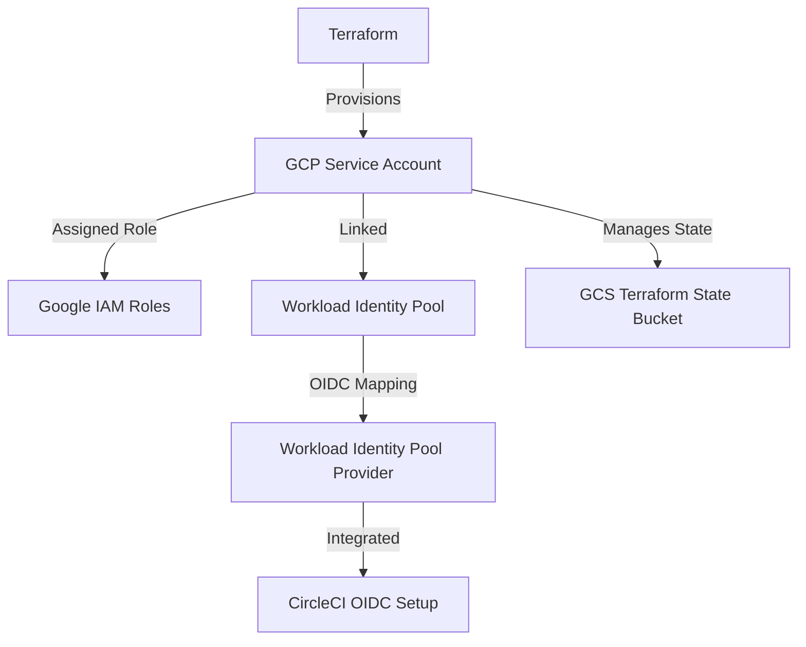

# Terraform GCP Service Account Setup

## Overview
This Terraform script provisions a Google Cloud Platform (GCP) service account, configures IAM roles, and sets up Workload Identity Pool for CircleCI integration. The infrastructure state is managed in a Google Cloud Storage (GCS) bucket.

## Resources Created
- **Service Account:** A new GCP service account for Terraform usage.
- **IAM Role Assignment:** Assigns `roles/owner` to the service account.
- **Workload Identity Pool & Provider:** Configures workload identity for secure authentication with CircleCI.
- **GCS Backend:** Stores Terraform state in a GCP storage bucket.

## Prerequisites
Ensure the following are set up before applying the Terraform script:
- Google Cloud SDK installed and configured.
- A GCP project created.
- Terraform installed (`>=1.8.0`).

## Variables
The Terraform script uses several variables. Below are the key ones:

| Variable Name | Type | Default | Description |
|--------------|------|---------|-------------|
| `gcp_project_id` | string | `dev-vijay-pandian` | The GCP project ID where resources will be created. |
| `gcp_service_account` | string | `vijay-tf-gcp-service-account` | The name of the GCP service account. |
| `workload_identity_pool_id` | string | `vijay-server47-pool` | The Workload Identity Pool ID. |
| `circleci_oidc_org_id` | string | `62ab4513-c6aa-4646-8189-a498fdbdb0d1` | The OIDC organization ID for CircleCI. |
| `circle_gcp_tf_state_bucket_name` | string | `vijay-tf-state-gcp` | The GCS bucket name for storing Terraform state. |

## Usage
1. Initialize Terraform:
   ```sh
   terraform init
   ```
2. Plan the infrastructure changes:
   ```sh
   terraform plan tfapply
   ```
3. Apply the Terraform configuration:
   ```sh
   terraform apply -auto-approve tfapply
   ```
4. Destroy the infrastructure if needed:
   ```sh
   terraform plan tfapply -destroy
   terraform destroy -auto-approve
   ```

## Outputs
| Output Name | Description |
|-------------|-------------|
| `service_account_attributes` | Contains details of the created service account (email, unique ID, name, etc.). |
| `bucket_name` | Outputs the name of the Terraform state bucket. |

## Architecture Diagram


## Notes
- Ensure you have appropriate permissions to create and manage IAM roles.
- Workload Identity Pools allow external authentication, reducing the need for service account keys.
- The Terraform state is stored in a GCS bucket for team collaboration and remote state management.
